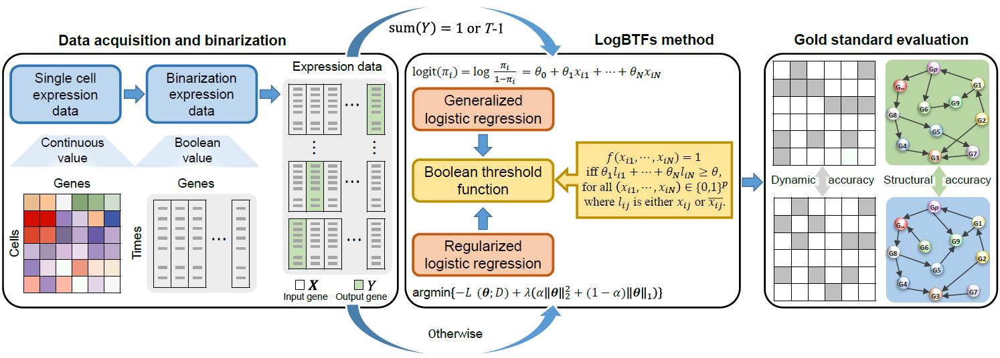

# [LogBTF (Embedding logistic regression into Boolean threshold function to reconstruct Boolean threshold network model)](https://github.com/zpliulab/logBTF)



In this work, an **embedded Boolean threshold network model by aggregating logistic regression with Boolean threshold function (LogBTF)** for inferring gene regulatory networks from single-cell gene expression data was proposed. 


## LogBTF
<!--START_SECTION:news-->
* **LogBTF**: A **embedded Boolean threshold network model (LogBTF)** is proposed to infer **gene regulatory networks (GRNs)**. 
* In the comparison study, we also proved the proposed **LogBTF method** results in better inference performance than one regression-based method **SINCERITIES**, two ordinary differential equation-based methods: GRISLI and SCODE, two miscellaneous methods: **GENIE3** and **TIGRESS**, two correlation-based methods: **ARACNE** and **CLR**.
* **Reminder**: Before running all programs, you need to **modify the path of the folder** where the corresponding input or output data or function is located.
* If you have any questions about **LogBTF**, please directly contact the corresponding author [Prof. Zhi-Ping Liu](https://scholar.google.com/citations?user=zkBXb_kAAAAJ&hl=zh-CN&oi=ao) with the E-mail: zpliu@sdu.edu.cn
<!--END_SECTION:news-->


## Citation
Li, Lingyu, et al. "**LogBTF: Gene regulatory network inference using Boolean threshold networks model from single-cell gene expression data**." Submit to [Bioinformatics](https://academic.oup.com/bioinformatics). 


## Data
<!--START_SECTION:news-->
* **Supplementary Materials** file present the necessary **Additional files** contained in our work.
* **Data** file give some necessary input/output files by the **R/Matlab/Python** codes. The subfile **DREAM3_RealData2** is the Matsumoto RNA-seq data, and the subfile **DREAM3_RealData16** is the Specific hHEP scRNA-seq data.
* Some of these input files only give the first few lines, limited by upload file size, but this does not affect the results of our work (**LogBTF**).
* **Cytoscape** file, we give the inferred LMPP gene regulatory network. 
<!--END_SECTION:news-->

## R packages
* [R.utils](https://cran.r-project.org/web/packages/R.utils/index.html) (v2.12.2). For various programming utilities.
* [BiTrinA](https://cran.r-project.org/web/packages/xlsx/index.html) (v0.6.5). Read/write/format Excel 2007 and Excel 97/2000/XP/2003 file formats.
* [caret](https://cran.r-project.org/web/packages/caret/index.html) (v6.0-93). Misc functions for training.
* [Matrix](https://cran.r-project.org/web/packages/Matrix/index.html) (v1.5-3). For the rich hierarchy of matrix classes.
* [BiTrinA](https://cran.r-project.org/web/packages/BiTrinA/index.html) (v1.3). For the binarization of simulated bulk gene expression data.
* [glmnet](https://cran.r-project.org/web/packages/glmnet/index.html) (v4.1-6). To conduct regularized generalized Linear models (Elastic net penalty).
* [ppcor](https://cran.r-project.org/web/packages/ppcor/index.html) (v1.1). Calculating partial and semi-partial (part) correlations in SINCERITIES method.
* [tigress](https://cran.r-project.org/web/packages/tigris/index.html) (v1.6.1). For the implication of TREGRESS method.
* [minet](http://www.bioconductor.org/packages/release/bioc/html/minet.html) (v4.2). For the implication of ARACNE and CLR methods.
    ```ruby
    if (!require("BiocManager", quietly = TRUE))
    install.packages("BiocManager")

    BiocManager::install("minet")
    ```
* [GENIE3](https://bioconductor.org/packages/release/bioc/html/GENIE3.html) (v4.2). For the implication of GENIE3 method.
    ```ruby
    if (!require("BiocManager", quietly = TRUE))
    install.packages("BiocManager")

    BiocManager::install("GENIE3")
    ```
* [randomForest](https://CRAN.R-project.org/package=randomForest) (v4.7-1.1). For the implication of GENIE3 method.
* [pROC](https://cran.r-project.org/web/packages/randomForest/index.html) (v1.18.0). For the display and analyze ROC curves.
* [dplyr](https://cran.r-project.org/web/packages/dtplyr/index.html) (v7.3-58.1). Provides a data.table backend.
* [ggplot2](https://cran.r-project.org/web/packages/ggplot2/index.html) (v3.4.0). Create elegant data visualisations.
* [stringr](https://cran.r-project.org/web/packages/stringr/index.html) (v4.1). Use set of wrappers around the fantastic 'stringi' package.
* [ggprism](https://cran.rstudio.com/web/packages/ggprism/index.html) (v1.0.4). Used to customise ggplots.
* [tidyverse](https://cran.r-project.org/web/packages/tidyverse/index.html) (v1.3.2). share common data representations.
* [reshape2](https://cran.r-project.org/web/packages/reshape2/index.html) (v1.4.4). Flexibly restructure and aggregate data.

## R codes
The **serial number (1), (2), ..., (14)** represents the order in which the program runs in our work. All experiments are conducted on a workstation with two Xeon Gold 6226R CPUs and 256G of RAM

<!--START_SECTION:news-->
* (1) PermanceFunction.R  --  The function to evaluate inferred network performance.
* (2) MethodFuction.R  --  The functions (main code) for some methods.
* (3) mydataexamgather.R  --  The code for the Artificial data results. The data is generated by mydataexam.py code and saved in File Atta.
* (4) scDataGenerate.R  --  Generate single-cell dataset based on GNW and plot the distribution of expression values.
* (5) LogBTF.R  --  LogBTF method on the simulated dataset (Ecoli and Yeast1), where the single-cell data are based on bulk data, but for LogBTF methods, all of them are converted into Boolean value data.
* (6) SCODE.R  --  SCODE method (based on MethodFuction.R) on simulated single-cell data, bulk data and real scRNA-seq data. 
* (7) SINCERITIES.R  --  SINCERITIES method on simulated single-cell data, bulk data and real scRNA-seq data.
* (8) GENIE3.R  --  GENIE3 method on simulated single-cell data, bulk data and real scRNA-seq data.
* (9) TREGRESS.R  --  TREGRESS method on simulated single-cell data, bulk data and real scRNA-seq data.
* (10) ARACNE  --  ARACNE method on simulated single-cell data, bulk data and real scRNA-seq data.
* (11) CLR.R  --  CLR method on simulated single-cell data, bulk data and real scRNA-seq data.
* (12) BarBoxPlot.R -- Visualize results of the simulated single-cell, bulk RNA-seq data and two real scRNA-seq data.
* (13) LMPPGlmPenalty0803.R  --  LogBTF method on LMPP dataset, compare with SINCERITIES.
* (14) LMPPGlmPenalty0803SINCERITIES.R  --  SINCERITIES method on LMPP dataset.
<!--END_SECTION:news-->


## Python packages.
* [boolean2]( https://github.com/janlelis/boolean2) (v1.0.1). For updated node’s state at next time point.

## boolean2 Setup
Add to your `Gemfile`:

```ruby
gem 'boolean2'
```

## boolean2 Usage
```ruby
true.is_a? Boolean2 #=> true
false.is_a? Boolean2 #=> true
nil.is_a? Boolean2 #=> false
Object.new.is_a? Boolean2 #=> false

true.to_boolean2 #=> true
false.to_boolean2 #=> false
nil.to_boolean2 #=> false
Object.new.to_boolean2 #=> true

Boolean2.new(true) #=> true
Boolean2.new(false) #=> false
Boolean2.new(nil) #=> false
Boolean2.new(Object.new) #=> true
```

* [matplotlib.pyplot]( https://matplotlib.org/stable/tutorials/introductory/pyplot.html) (v3.6.2). 
* [matplotlib.patches]( https://matplotlib.org/stable/api/patches_api.html) (v3.6.2). 
* [pylab](https://www.javatpoint.com/python-pylab-module). 
* [pandas](https://www.datacamp.com/tutorial/pandas) (v1.5.2).

pip install pandas
import pandas as pd

## Python codes
<!--START_SECTION:news-->
* mydataexam.py – The generated data for the next time point of Artificial data.
<!--END_SECTION:news-->


## Matlab codes
<!--START_SECTION:news-->
* pseudo-data-order.m  --  Order the single-cell according to pseudo-time information.
* GRISLIscmain.m  --  The GRISLI method, which is implemented with MATLAB. 
* All other codes  --  They serve the main program GRISLIscmain. 
<!--END_SECTION:news-->


## LogBTF (2022), Zhi-Ping Liu all rights reserved
This program package is supported by the copyright owners and coders "as is" and without warranty of any kind, express or implied, including, but not limited to, the implied warranties of merchantability and fitness for a particular purpose. In no event shall the copyright owner or contributor be liable for any direct, indirect, incidental, special, exemplary, or consequential damages (including, without limitation, procurement of substitute goods or services; loss of use, data, or profits; or business interruption), regardless of the theory of liability, whether in contract, strict liability or tort (including negligence or otherwise) for any use of the software, even if advised of the possibility of such damages.
